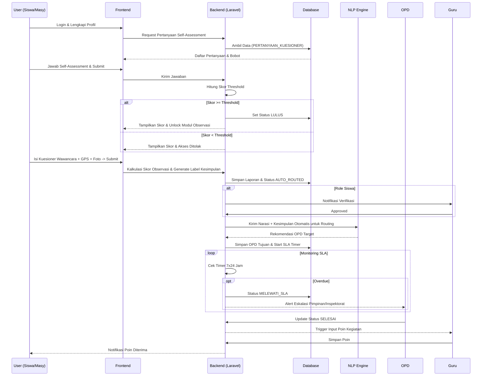
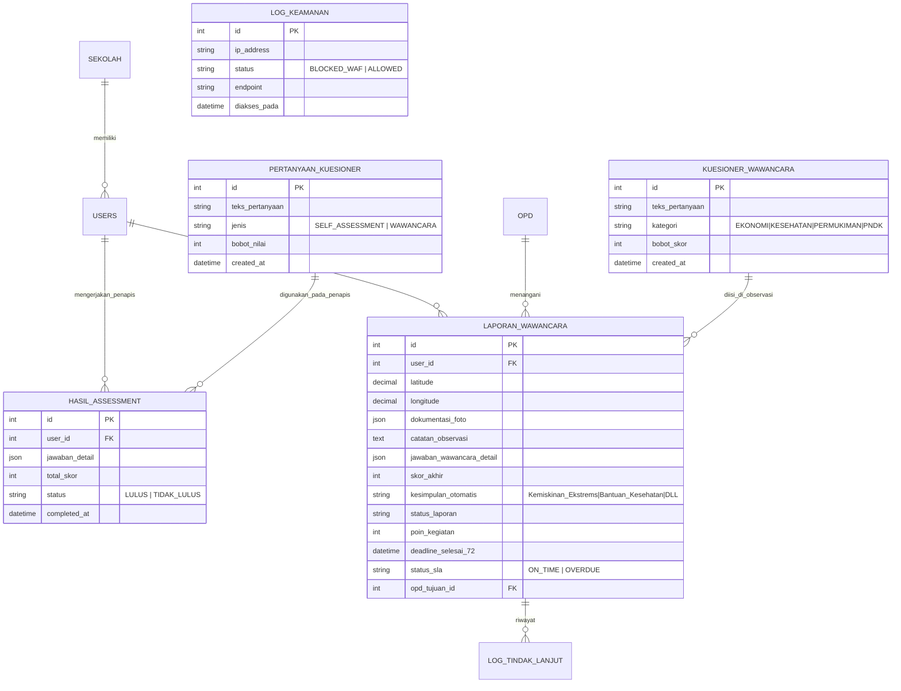

# PRD — Project Requirements Document

## 1. Overview
Aplikasi "Tengok Tetangga" adalah platform closed-loop manajemen kasus sosial yang mengintegrasikan peran Siswa dan Masyarakat dalam pelaporan kondisi sosial di lapangan. Untuk memastikan kualitas pelapor, pengguna wajib melewati gatekeeper berupa **Self-Assessment Dinamis**. Jika skor memenuhi ambang batas (passing grade), sistem membuka akses untuk melakukan observasi geospasial. Selama observasi, pengguna mengisi **Kuesioner Wawancara Lapangan** yang bersifat dinamis. Sistem secara otomatis menghitung skor kumulatif dan menghasilkan **Label Kesimpulan** berdasarkan kondisi yang dilaporkan. Dokumen ini disertai dokumentasi foto dan koordinat GPS, lalu diproses melalui mesin **Auto-Routing AI/NLP** yang mempertimbangkan kesimpulan otomatis menuju Organisasi Perangkat Daerah (OPD) terkait, dengan pengawasan SLA 7x24 jam. Sistem mencakup loop feedback akademik bagi Siswa melalui verifikasi Guru dan pemberian poin kegiatan. Dashboard Admin didukung oleh Redis caching untuk visualisasi heatmap real-time serta fitur Data Masking untuk menjaga privasi warga dalam ekspor laporan. Keamanan sistem diperkuat dengan WAF dan Rate Limiting untuk mitigasi serangan siber.

## 2. Requirements
- **Autentikasi OAuth2:** Login wajib menggunakan akun Google/Gmail.
- **Profil & Role:** Wajib mengisi profil pasca-login (NIK, Kontak, Peran). Siswa wajib memilih sekolah asal.
- **Manajemen Kuesioner Dinamis:** Admin dapat mengelola (CRUD) bank soal Self-Assessment dan Kuesioner Wawancara Lapangan beserta bobot nilai masing-masing.
- **Logic Self-Assessment:** Sistem menghitung skor dari kuesioner penapis secara real-time. Akses ke modul observasi hanya terbuka jika status = `LULUS` (skor >= passing grade).
- **Kuesioner Wawancara Dinamis:** Kuesioner observasi lapangan dikelola secara dinamis oleh Admin, dilengkapi bobot skor untuk menghasilkan kesimpulan otomatis kondisi sosial.
- **Dual-Track Validasi:** 
  - **Siswa:** Verifikasi Guru → Persetujuan → Auto-Routing OPD.
  - **Masyarakat:** Langsung Auto-Routing OPD.
- **OPD Case Management & SLA:** Penanganan kasus dengan timer 7x24 jam. Jika melampaui batas, status berubah menjadi `MELEWATI_SLA` dengan flag merah dan eskalasi ke inspektorat/pimpinan.
- **Engine Auto-Mapping Cerdas:** Menggunakan `kesimpulan_otomatis` dari skor kuesioner observasi, kategori urusan, dan analisis NLP pada catatan observasi untuk menentukan OPD tujuan secara akurat.
- **GIS & Caching:** Penyimpanan koordinat lokasi dan visualisasi Heatmap di dashboard Admin yang dioptimalkan dengan Redis.
- **Keamanan & Privasi:** Implementasi WAF, Rate Limiting, dan Data Masking otomatis (anonimisasi NIK/Nama) pada dokumen ekspor eksekutif.

## 3. Core Features
- **Modul Manajemen Kuesioner (Admin):** Panel kontrol untuk menambah, mengedit, dan menghapus pertanyaan Self-Assessment serta pertanyaan Kuesioner Wawancara Lapangan beserta bobot nilainya.
- **Engine Kelayakan (Self-Assessment):** Antarmuka bagi user untuk menjawab kuesioner penapis. Sistem melakukan kalkulasi otomatis dan menampilkan skor serta status kelulusan.
- **Modul Observasi Dinamis & Scoring:** Form input laporan terintegrasi kamera (upload foto) dan penanda lokasi GPS. Form ini memuat kuesioner wawancara lapangan yang bobotnya dikelola Admin. Hasil akhir observasi akan menghasilkan skor kumulatif dan 'Label Kesimpulan' (contoh: Kemiskinan Ekstrem, Perlu Bantuan Kesehatan, dll) secara otomatis sebelum data dikirim ke engine routing.
- **Engine Auto-Mapping (AI-Assisted):** Rekomendasi OPD target berdasarkan ekstraksi narasi menggunakan NLP, dipertajam dengan integrasi `kesimpulan_otomatis` dari hasil skor kuesioner observasi.
- **OPD Dashboard & Action Engine:** Interface bagi OPD untuk mengelola laporan (Proses, Limpahkan, Kolaborasi, Selesai) dilengkapi visualisasi timer SLA dan akses ke bukti foto/dokumen.
- **Feedback Loop Akademik:** Notifikasi otomatis ke Guru untuk pemberian poin kegiatan siswa setelah status kasus `SELESAI`.
- **Dashboard GIS & Admin Tools:** Heatmap distribusi kasus berbasis Redis Cache dan engine ekspor laporan dengan filter Data Masking dinamis untuk perlindungan privasi warga.

## 4. User Flow
1. **Pendaftaran:** User Login via Google -> Melengkapi Profil (Role, NIK, Sekolah).
2. **Uji Kelayakan (Self-Assessment):** 
   - User menjawab pertanyaan kuesioner penapis dinamis.
   - Sistem menjumlahkan bobot nilai secara real-time.
   - **Jika Lulus:** Tampilkan skor + "LULUS" -> Membuka Modul Observasi.
   - **Jika Gagal:** Tampilkan skor + "TIDAK LULUS" -> Akses terkunci (User dapat mengulang sesuai kebijakan).
3. **Observasi:** User mengisi kuesioner wawancara lapangan (dinamis) -> Simpan GPS + Foto -> Submit. Sistem menghitung skor kumulatif dan menghasilkan Label Kesimpulan otomatis.
4. **Verifikasi & Routing:**
   - *Siswa:* Guru Review -> Setujui -> Sistem Auto-Route ke OPD.
   - *Masyarakat:* Sistem langsung Auto-Route ke OPD. Routing mempertimbangkan Label Kesimpulan dan analisis NLP.
5. **Penanganan OPD:** 7x24 jam SLA dimohonkan -> OPD melakukan aksi (Proses/Limpahkan/Kolaborasi) -> Status `SELESAI`.
6. **Eskalasi:** Jika melewati 7x24 jam tanpa aksi -> Flagging Merah -> Notifikasi ke Inspektorat.
7. **Penyelesaian:** Status `SELESAI` -> Guru memberi input Poin Kegiatan -> Notifikasi ke Siswa.

## 5. Architecture

## 6. Database Schema

## 7. Tech Stack
- **Frontend:** Next.js, Tailwind CSS, React-Leaflet (GIS).
- **Backend:** Laravel 11 (OAuth2, SLA Scheduler, Caching, Dynamic Form Builder).
- **Database:** PostgreSQL (Core Data, JSONB untuk jawaban dinamis), Redis (GIS Heatmap Caching & Session).
- **AI Service:** Python Microservice/API LLM untuk NLP Routing & Sentiment Analysis pada narasi observasi.
- **Security:** NGINX WAF, Laravel Rate Limiter, Data Masking Service (Regex/Token Replacement).
- **DevOps:** Docker, S3-Compatible Image Storage, CI/CD Pipeline.